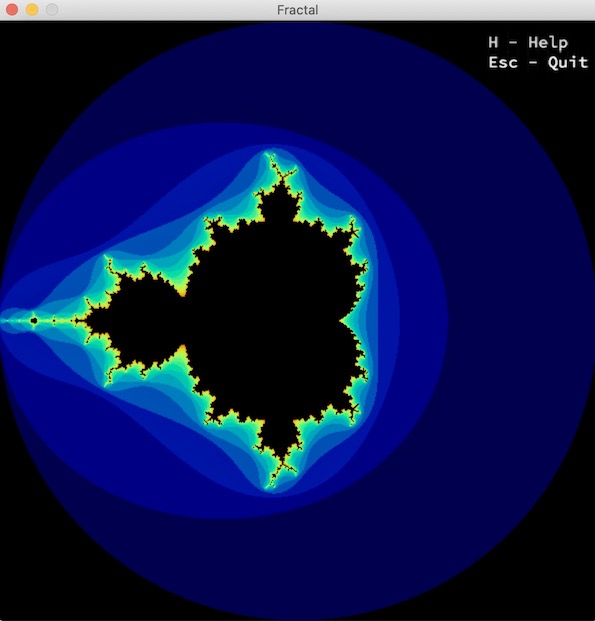

# Fractal

A multithreaded fractal renderer.

## Features

* Render different fractals: Mandelbrot, Julia, Burning Ship, Mandelbar, Buffalo
* Different color schemes
* Infinite zoom (within the limits of the computer)
* Moving with the arrow keys
* Multi-threading implementation

## Usage

### Compiling

Run the following commands:

* To compile
	- `make`
* To remove objects:
	- `make clean`
* To remove objects and binary file (program):
	- `make fclean`
* To re-compile:
	- `make re`

### Executing

`./fractal <number>`

Press 1 for 'Mandelbrot', 2 for 'Julia', 3 for 'Burning Ship', 4 for 'Mandelbar', 5 for 'Buffalo'
